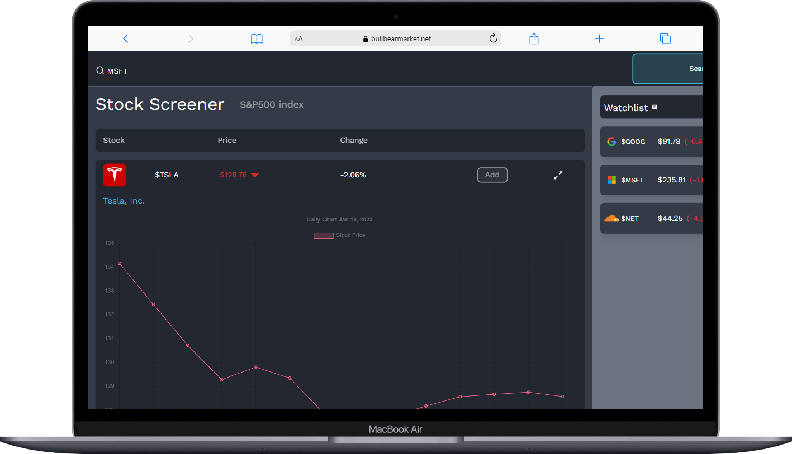
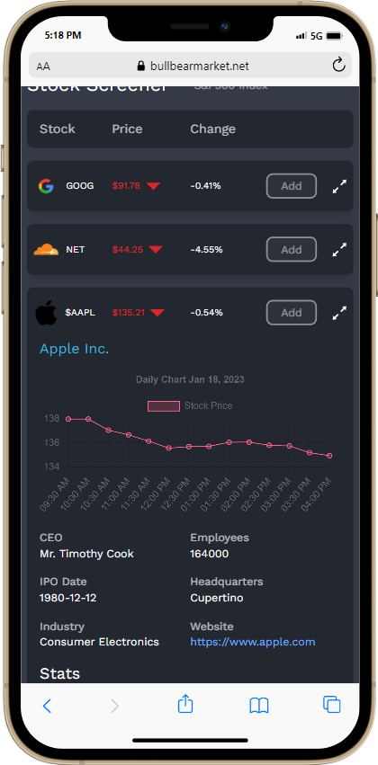

# BullBear

#### BullBear is a MERN stack web app that lets users create an account and add stocks from the S&P500 index to their own personal watch list.

#### [link to BullBear app](https://bullbearmarket.net/)

## Description

I decided to build this web app since I enjoy investing and reading up on stocks, and what better way to keep track of my stocks than to build out my own stock tracking application.


<!--  -->



## Usage

- Create an account and view market data about your favorite stocks.
- Add stock tickers to your own watchlist.
- See details such as latest price, volume, market cap, recent news, and broad market index quotes.

## Technologies used:

- [x] React
- [x] Javascript
- [x] Node.js
- [x] Express.js
- [x] Tailwind CSS
- [x] MongoDB
- [x] User Authentication
- [x] Chart.js
- [x] Client hosted on Vercel
- [x] Server deployed on Heroku
- [x] [Fmp Cloud stock data API endpoints](https://fmpcloud.io/)
- [x] Context API

## User Stories

The following functionality is completed:

- [x] User can create an account and sign in.
- [x] The user should switch between different tabs - viewing the dashboard, market, or home page.
- [x] User can search all stocks listed in the S&P500 Index.
- [x] User can add and delete stocks from their own personal watchlist.
- [x] User can view up to date news articles about the most prominent stocks in the market.
- [x] User can view the stats and metrics about different stock tickers.

# Installation

## Setting up the Client

cd into the Client/ directory and run:

```
npm install
```

```
npm start
```

## Setting up the Express Server

#### To start the server, you can cd into the Server/ directory and run:

```
npm install
```

```
node server.js
```
